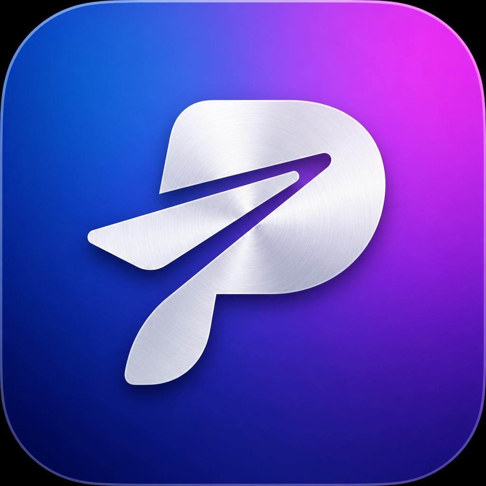
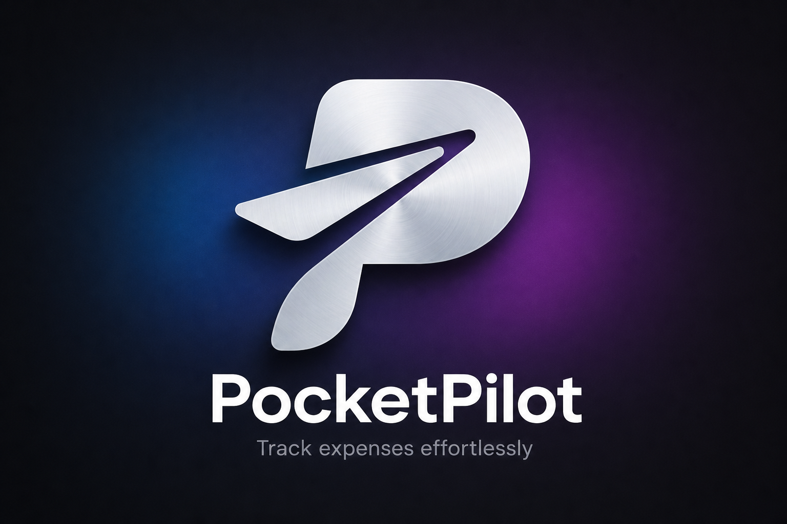

# PocketPilot

SwiftUI iOS app for tracking expenses — auth, dashboard, receipts, squads, reports, and real-time updates.

<p align="center">
  
</p>

<p align="center">
  
</p>

## Requirements

- macOS with **Xcode 15+**
- **iOS 17.0+**
- **Swift 5.9+**
- CocoaPods (`sudo gem install cocoapods`)

> iOS apps cannot be built on Windows. Use a Mac, a cloud Mac (MacStadium, MacinCloud, AWS EC2 Mac), or a remote Mac session.

## Quick start

```bash
cd PocketPilot-Fe
pod install
open pocketPilot.xcworkspace   # open the workspace, not .xcodeproj
```

1. Set your API URLs in `pocketPilot/Core/Utilities/Constants.swift`
2. Select a simulator or device in Xcode
3. Run with **⌘R**

### API config

```swift
struct Constants {
    struct API {
        static let baseURL = "https://your-api-url.com/api/v1"
        static let timeout: TimeInterval = 30.0
        static let webSocketURL = "wss://your-api-url.com/ws"
    }
}
```

## Features

| Area | What’s included |
|------|-----------------|
| **Auth** | Login, sign up, forgot password, token refresh, Keychain storage |
| **Dashboard** | Totals, monthly stats, category breakdown, recent expenses |
| **Expenses** | CRUD, categories, search & filters, detail views |
| **Budget** | Budget tracking module |
| **Receipts** | Camera / library capture, review & preview flow |
| **Squads** | Shared groups, settlements, join/create flows |
| **Reports** | History & export |
| **Chat** | In-app chat with floating entry point |
| **Gamification** | Achievements |
| **Notifications** | List + settings |
| **Profile** | Edit profile, settings, currency |

## Project structure

```
PocketPilot-Fe/
├── branding/                 # Logo extracts & presentation PNGs
├── pocketPilot/
│   ├── App/                  # Entry, welcome, root navigation
│   ├── Assets.xcassets/      # AppLogo, AppIcon
│   ├── Core/                 # Auth, Network, Storage, WebSocket, Utilities
│   └── Features/             # Feature modules (MVVM)
└── pocketPilot.xcodeproj/
```

## Architecture

- **MVVM** with Swift `@Observable` (iOS 17+)
- **Async/await** networking via Alamofire
- Feature-first folders; shared UI under `Features/Components`

## Dependencies

- [Alamofire](https://github.com/Alamofire/Alamofire) (~> 5.8) — HTTP
- [KeychainAccess](https://github.com/kishikawakatsumi/KeychainAccess) (~> 4.2) — secure storage

## Branding

Source assets live in `Assets.xcassets` (`AppLogo` / `AppIcon`, 1024×1024). Presentation copies:

| File | Use |
|------|-----|
| `branding/pocketpilot-logo-source.png` | Exact extract from the app |
| `branding/pocketpilot-icon-presentation.png` | App icon for decks / README |
| `branding/pocketpilot-wordmark-presentation.png` | Logo + wordmark lockup |

Mark: brushed-metal **P** with a paper-airplane wing on a blue → magenta gradient.

## API overview

Expected REST shape:

```json
{ "success": true, "data": { }, "message": null, "error": null }
```

| Group | Endpoints |
|-------|-----------|
| Auth | `POST /auth/login`, `/signup`, `/logout`, `/refresh`, `/forgot-password`, `/reset-password`, `/change-password`; `GET /auth/me`; `PUT /auth/profile` |
| Expenses | `GET/POST /expenses`, `GET/PUT/DELETE /expenses/:id` |
| Dashboard | `GET /dashboard` |
| Realtime | `WS /ws` |

## Troubleshooting

| Issue | Fix |
|-------|-----|
| Build errors | Clean (**⇧⌘K**), re-run `pod install`, open `.xcworkspace` |
| Network | Check `Constants.swift` base URL and backend reachability |
| CocoaPods | `pod deintegrate && pod install` |

## License

Add your license here.
